## Before Dukaan (pg 18)
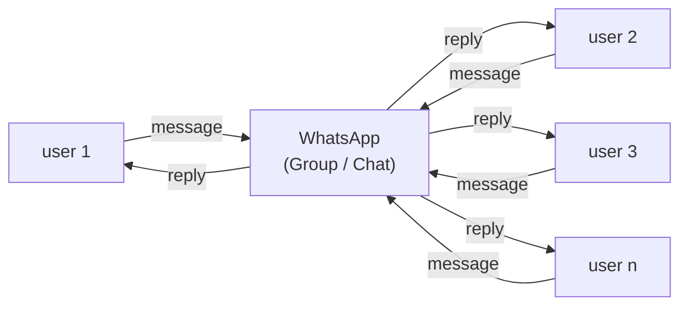

### A customer interacting with a busy WhatsApp-Shop Owner

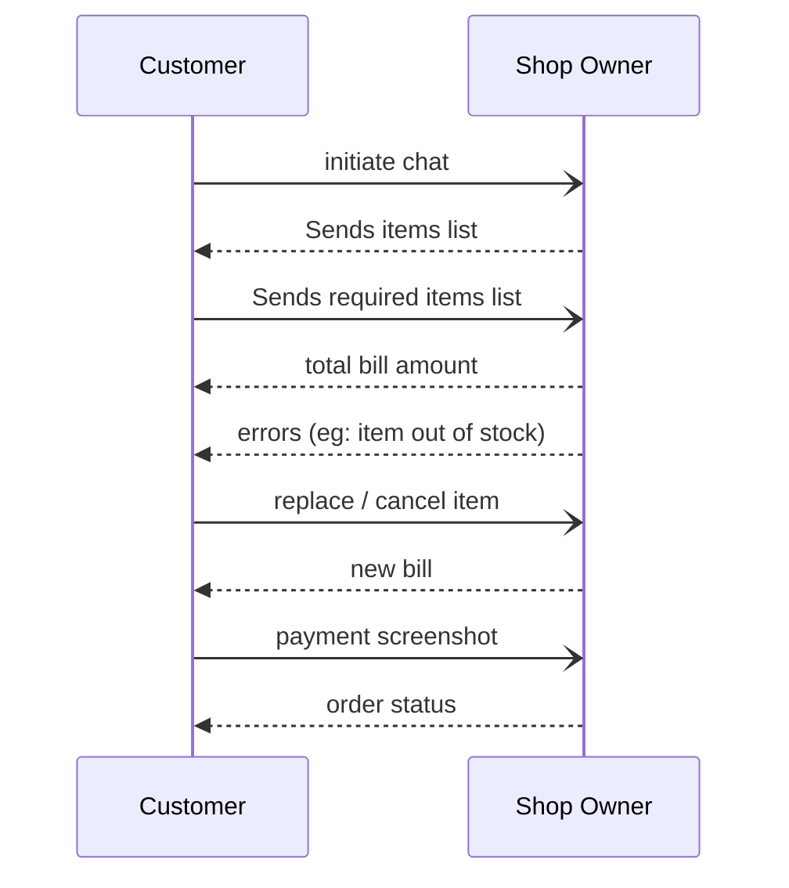

---

## Single Box / Monolith (pg 34)

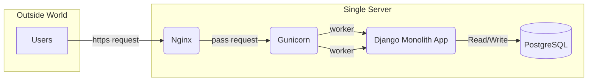

---

## Separating App & DB (pg 43)
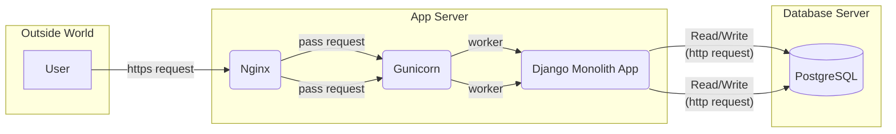

---

## The Traffic Cop - Nginx as a Load Balancer (pg 74)

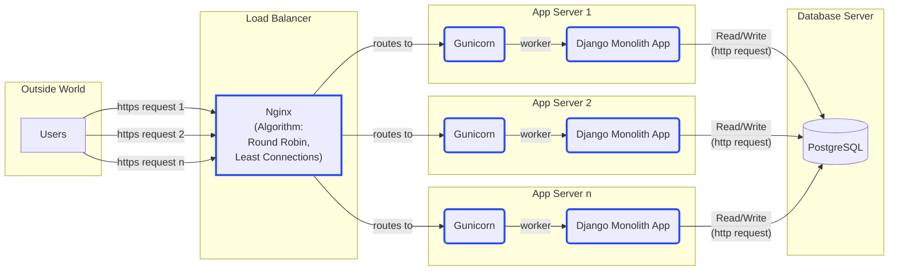

---

## Splitting the DB (pg 86)

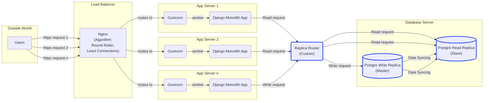

---

## Dev to Prod Workflow (pg 101)

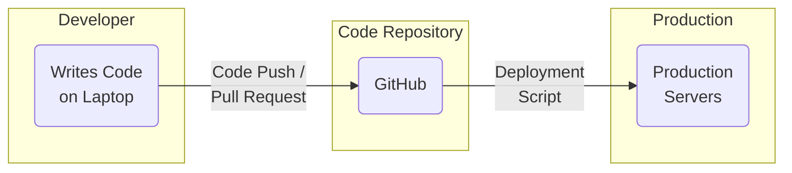

---

## Improved Dev to Prod Workflow (pg 115)

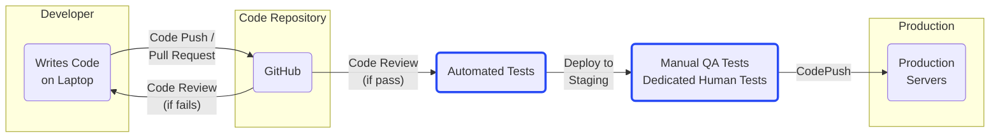

 

They went from a group of coders to a Professional Engineering team

---

## Adding Cache Layer - Redis (pg 128)

```mermaid
flowchart LR

    %% External User
    subgraph "Outside World"
        A[Users]
    end

    N["Nginx<br>Load Balancer"]

    %% External Requests
    A -- https request 1 --> N
    A -- https request 2 --> N
    A -- https request n --> N

    %% App Servers
    subgraph "App Servers (AS)"
        direction LR
        AS1[AS1: Gunicorn → Django App]
        AS2[AS2: Gunicorn → Django App]
        AS3[AS3: Gunicorn → Django App]
        AS4[AS4: Gunicorn → Django App]
        ASN[ASn: Gunicorn → Django App]

        %% Force vertical alignment using invisible links (~~~)
        AS1 ~~~ AS2 ~~~ AS3 ~~~ AS4 ~~~ ASN
    end

    %% Route traffic to each server
    N --> AS1
    N --> AS2
    N --> AS3
    N --> AS4
    N --> ASN

    %% Redis Cache
    RC["Redis Cache"]

    %% Django <--> Redis interactions
    AS1 -- Read request --> RC
    RC -- "Cache Hit <br> (Read request)" --> AS1

    AS2 -- Read request --> RC
    RC -- "Cache Miss <br> (Write request)" --> RR

    AS3 -- Write request --> RC
    RC -- "Cache Hit <br> (Read request)" --> AS3

    AS4 -- Write request --> RC
    RC -- "Cache Miss <br> (Write request)" --> RR

    ASN -- request --> RC
    RC -- "Cache Hit <br> (nth request)" --> ASN
    RC -- "Cache Miss <br> (nth request)" --> RR

    %% Replica Router
    RR["Replica Router<br>(Custom)"]

    %% Database Cluster
    subgraph DB["Database Server"]
        direction TB
        PWR[("Postgre Write Replica<br>(Master)")]
        PRR[("Postgre Read Replica<br>(Slave)")]
    end

    RR -- Read request --> PRR
    RR -- Write request --> PWR
    PWR -- Data Syncing --> PRR

%% Highlight new components
classDef newEntry stroke:#2749F5,stroke-width:3px;
class RC newEntry;
```

---

## Monolith to Microservices (pg 149)

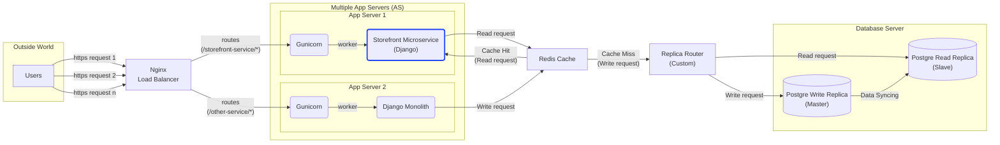

---

## Apache Kafka & Change Data Capture (pg 162)

```mermaid
flowchart LR

    %% External User
    subgraph "Outside World"
        A[Users]
    end

    N["Nginx<br>Load Balancer"]

    %% External Requests
    A -- https request 1 --> N
    A -- https request 2 --> N
    A -- https request n --> N

    %% App Servers
    subgraph "Multiple App Servers (AS)"
        direction LR

        subgraph "App Server 1"
        direction LR
        G1(Gunicorn) -- worker --> SFM["Storefront Microservice <br> (Django)"]
        end

        subgraph "App Server 2"
        direction LR
        G2(Gunicorn) -- worker --> DM["Django Monolith"]
        end

    end

    %% Route traffic to each server
    N -- "routes <br> (/storefront-service/*)"  --> G1
    N -- "routes <br> (/other-service/*)" --> G2

    %% Redis Cache
    RC["Redis Cache"]

    %% Django <--> Redis interactions
    SFM -- Read request --> RC
    RC -- "Cache Hit <br> (Read request)" --> SFM

    DM -- Write request --> RC
    RC -- "Cache Miss <br> (Write request)" --> RR

    %% Replica Router
    RR["Replica Router<br>(Custom)"]

    %% Database Cluster
    subgraph DB["Database Server"]
        direction TB
        PWR[("Postgre Write Replica <br> Write-Ahead Log (Master)")]
        PRR[("Postgre Read Replica <br> (Slave)")]
    end

    RR -- Read request --> PRR
    RR -- Write request --> PWR
    PWR -- Data Syncing --> PRR

    %% New Entries (Debezium and Kafka)
    PWR <-- Watching --> DEB["Debezium"]
    DEB -- "Writes changes <br> in Kafka Topic" --> K["Kafka"]
    K -- "Sink Connector <br> (Renews Cache)" --> RC

%% Highlight new components
classDef newEntry stroke:#2749F5,stroke-width:3px;
class DEB,K newEntry;
```

---

## Containerization using Docker (pg 177)

Continuation of "Apache Kafka & Change Data Capture" only, but which all services were dockerized?

---