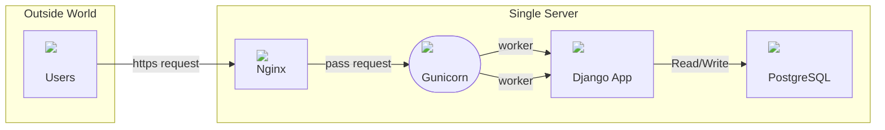

## Dukaan Starting Tech Stack

  
  
  
  
  
  
  

---

## Single Box / Monolith (pg 34)

```mermaid
%%{init: {'flowchart': {'htmlLabels': true}}}%%
graph LR
  %% Nodes
  A["<img src='../Icons/users.svg'><br/>Users"]
  N["<img src='../Icons/NGINX.svg'<br/>Nginx"]
  G(["<img src='../Icons/Gunicorn.svg' width='30'/><br/>Gunicorn"])
  D["<img src='../Icons/Django.svg'><br/>Django App"]
  P["<img src='../Icons/PostgreSQL.svg'><br/>PostgreSQL"]
  
subgraph Outside World
  direction LR
  A
end

subgraph Single Server
  direction LR
  A -- https request --> N
  N -- pass request --> G
  G -- worker --> D
  G -- worker --> D
  D -- Read/Write --> P
end
```

---
